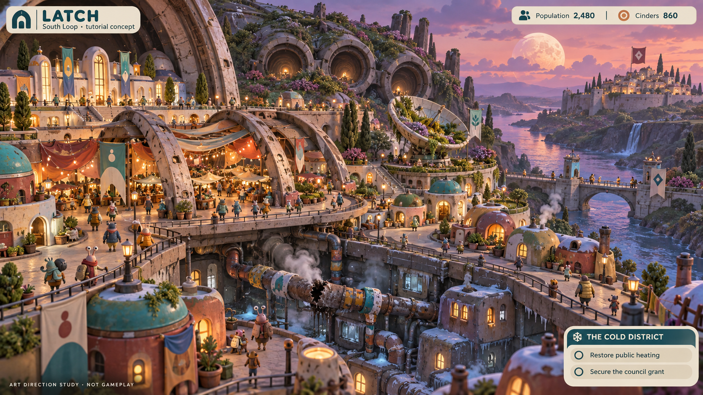

# Latch: a developed tutorial city

**Concept art, not a screenshot or an implemented tutorial.** This first city study is for visual review. The names Latch, South Loop and Cinders are provisional. Its displayed 2,480 inhabitants and 860 Cinders are illustrative; the playable prototype reports its actual simulated population and treasury.

The study shows homes built into ancient landing structures, an inhabited market, a garden in an old antenna, a warm administrative terrace and a damaged heat main serving the cold lower district. Another polity is visible across the river. The interface presents local population and the historically rooted currency rather than treating national identity as global ownership.

The mixed stylized residents explore scale and a creepy-cute character direction. They do not decide the player species' relationship to humanity. This study is strongest on warmth and layered infrastructure; further concepts should test stranger body plans and more unsettling ecology without returning to realistic armored portraits.

The two illustrated decision buttons are narrative sketches. Proposed branching abilities and obligations are described in [Campaign foundation](CAMPAIGN_FOUNDATION.md), and are not implemented in the current game.

Generated with the built-in imagegen tool. Final asset: `assets/concepts/latch-tutorial-city-v1.png`.

## Exact generation prompt

Use case: ui-mockup and stylized-concept. Asset type: one original visual concept board showing a developed tutorial city for Frontier Worlds, a creepy-cute space colony strategy game. This is a NEW art direction; no reference images.
Primary request: a genuinely playful, odd, endearing alien city-builder scene with small full-body creatures and toy-like architecture, affectionate spirit of early organic creature-based galaxy exploration games, with original designs. A developed city grown inside a derelict colonial outpost abandoned thousands of years ago. Cozy and a little unsettling, expressive and colorful, not photorealistic, not serious armored space-opera portraits.
Composition: wide 16:9 high-angle playable city view like a polished 3D diorama, medium-close scale so individual streets and residents are visible. The city fills most of the image; roughly 80 rounded mismatched homes, civic buildings, market stalls, a working heating plant, loop roads and footbridges. Small plump asymmetrical creatures with stubby feet and expressive eye stalks walk the streets, plus tiny stylized human-sized figures in puffy civilian clothing. Keep all figures tiny city residents, no portrait lineup. Their identity is exploratory, not a statement that every population is the same species.
World history in the scene: colorful homes built inside ancient curved landing struts, enormous worn pressure-door ribs supporting a market canopy, civic offices occupying the clean lit upper terrace, a lower residential district with a visibly broken steam main and cold windows. Pipes repaired with bright mismatched ceramic fittings. An old radar dish has become a public garden. The repairs matter: the city is inhabited, loved and inventive, not an empty ruin. A vast buried machine's three circular apertures resemble sleepy eyes but may just be architecture. No creepy faces on every building.
Political geography: a distant walled hill settlement flying a different simple geometric flag, separated by a river and a modest checkpoint bridge, indicating a neighboring nation on the same planet, not an alien invader. Neither flag resembles real organizations.
Palette/materials: soft clay-like forms, painted ceramic, warm terracotta, turquoise, moss green, mauve vegetation, amber warmth; dusk sky with a huge pale moon. Strong rounded silhouettes with a few curious pointed appendages. Surface detail restrained and legible. Expressive, slightly lopsided, handcrafted sci-fi. No gothic skulls, no realistic battle armor, no grimdark war debris, no existing game species or UI copied.
UI overlay: a restrained small playful cream-and-teal interface, readable at full image resolution. Exact top-left text 'LATCH' with small subtitle 'South Loop · tutorial concept'. Exact top bar text 'Population 2,480' and 'Cinders 860'. A small round currency symbol inspired by a fired-clay washer, not a dollar icon. A bottom-right small panel headed 'THE COLD DISTRICT' with two short choices 'Restore public heating' and 'Secure the council grant'. Do not imply these choices are implemented. Include tiny bottom-left text 'ART DIRECTION STUDY · NOT GAMEPLAY'. No other text necessary. The focus remains the city and its inhabitants.
